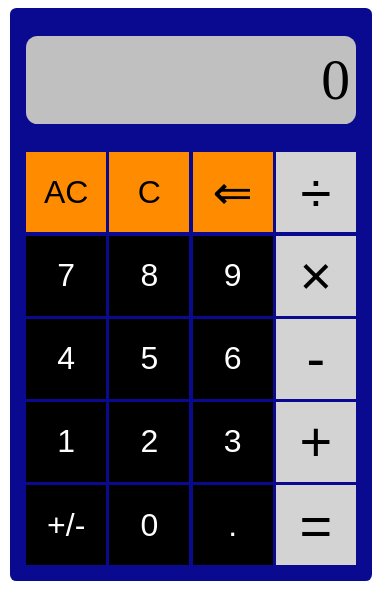

# Calculator Project

## Introduction

This [Calculator](https://mike-c2.github.io/odin-calculator) was made as a project for [The Odin Project](https://www.theodinproject.com). For more information about the project requirements, see:

[Project: Calculator](https://www.theodinproject.com/lessons/foundations-calculator)

 

## How to Use

Simply click on the buttons to perform the desired operations.  Keyboard keys can also be used instead.

Further explanation on some of the keys:

AC: All-Clear, uses the 'a' key.  This resets the calculator back to a blank state.  When encountering errors such as 'Overflow' or 'Div by 0!', this will be the only key that works.

C: Clear, uses the 'c' key.  This deletes the current number being entered, but not the previous number.

&lArr;: Delete, uses the backspace or 'd' keys.  While inputting a number, this will remove the right-most digit. If a new result is being shown, then it will delete the whole number, like the clear key.

&#247;: Division, its use is obvious, just mentioning that it uses the '/' key.

&#215;: Multiplication, its use is obvious, just mentioning that it uses the '*' key.

+/-: Flips the number from positive to negative and vice-versa.  Uses the '!' key ('-' was already taken for the subtraction key).